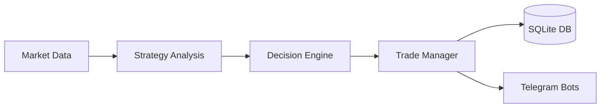

# 🏗️ System Architecture

This document outlines the modular design and data lifecycle of the Trading Bot ecosystem. The system is engineered for high-confluence execution, separating strategy logic from risk management and notification layers.

---

## 🧩 1. Core Engines (The Brains)

The system is divided into independent specialized engines to allow for modular scaling and risk isolation.

| Engine | Responsibility | Risk Profile |
| :--- | :--- | :--- |
| **Trading Engine** | Executes core, high-probability strategies (Breakout, Pullback). | Standard |
| **Extension Engine** | High-frequency, aggressive setups with lower confidence thresholds. | High |
| **Watchlist Engine** | Monitors user-defined or algorithmically selected assets for early setups. | Info Only |
| **Listing Engine** | Event-driven logic specifically for new exchange listings (e.g., Binance). | Opportunistic |
| **Market Scanner** | Continuous global scan (Spot/Futures) to rank and filter top movers. | Discovery |

---

## 🔄 2. Data & Execution Flow

The system follows a linear, low-latency pipeline from raw market data to final Telegram notification.

### Execution Lifecycle:
1. **Ingestion:** Fetch real-time OHLCV and volume data from exchange APIs.
2. **Analysis:** Apply technical indicators and structural logic (MTF Check).
3. **Scoring:** Assign a confidence score (0–100) based on confluence factors.
4. **Validation:** Build the trade object (Entry, SL, TP) and verify against risk rules.
5. **Execution:** Process the trade (currently Paper Trading mode) via the Trade Manager.
6. **Logging:** Commit trade metadata and session state to the database.

---

## 🗄️ 3. Storage Layer

The system utilizes a **SQLite** database for local persistence, ensuring lightweight performance and easy portability.

- **Trades Table:** Stores entry/exit prices, timestamps, strategies used, and PnL.
- **Balance Table:** Tracks virtual capital and equity curve history.
- **Stats Table:** Aggregates performance metrics (Win Rate, Drawdown, Streaks).

---

## 🤖 4. Bot Ecosystem (The Interface)

The system outputs to a multi-bot Telegram environment to prevent signal noise.

* **Standard Bot:** Receives high-confidence signals from the Trading Engine.
* **Extension Bot:** Separate channel for high-risk/aggressive volatility plays.
* **Watchlist Bot:** Alerts for early structural shifts or "Hot List" coins.
* **Stats Bot:** A dedicated administrative interface for `/stats`, `/equity`, and performance audits.

---

## 🛠️ 5. Technical Stack

- **Language:** Python
- **Database:** SQLite
- **Environment:** Linux
- **Communication:** Telegram Bot API
- **Logic:** Modular Engine Pattern (OOP)